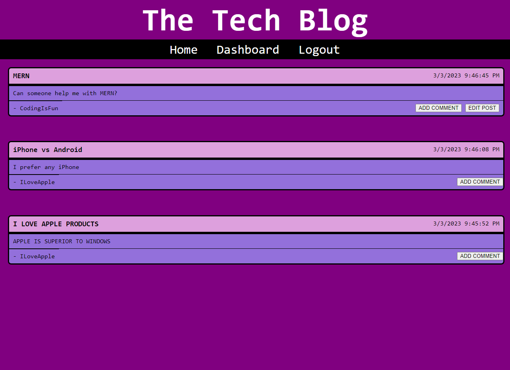
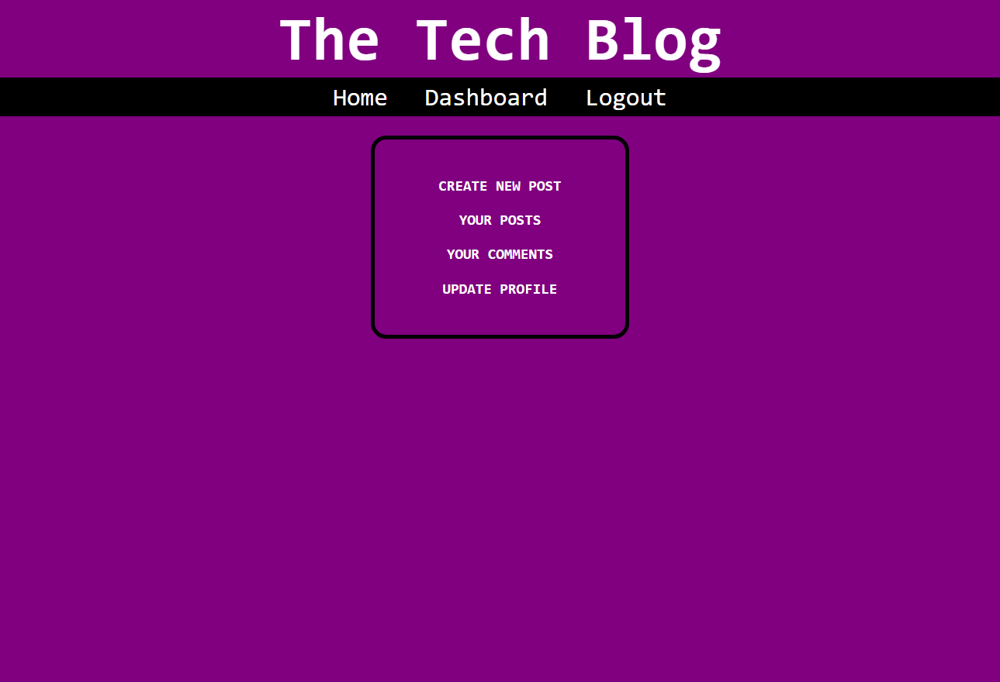

  # Tech Blog

  ## Description
This project is a CMS-style blog site similar to a Wordpress site, where developers can publish their blog posts and comment on other developers’ posts as well.

  ## Table of Contents
  * [Project Links](#links)
  * [Usage](#usage)
  * [Screenshots](#screenshots)
  * [Credits](#credits)
  * [License](#license)
  * [Contributing](#contributing)
  * [Tests](#tests)
  * [Questions](#questions)

  ## Links
  * [Deployed Application](https://sleepy-bayou-31524.herokuapp.com/)
  * [GitHub Repo](https://github.com/jeaustins27/Social-Network-API)

  ## Usage
To get started, you will need to clone the repo. Once your repo is cloned, to start the server run `npm start`. Navigate to the `LOGIN` button on the dashboard and signup. Once you are signed up, navigate to the `DASHBOARD` button, you will be able to create a new post here. Once the post is created you can view your posts directly from the dashboard or by navigating to the `HOME` button. You can comment on someone's post by pressing the `ADD COMMENT` button on the post, this will also add your comments to your dashboard as well.

If you'd like to simply use the app, click the link for the deployed action in the section above.

  ## Screenshots
  
  

  ## Credits
  * [W3Schools](https://www.w3schools.com/)
  * [Readme.so](https://readme.so/)
  * [Stack Overflow](https://stackoverflow.com)
  * [MongoDB](https://www.mongodb.com/)

  
  ## License
  
  
  This project is licensed under the [MIT](https://choosealicense.com/licenses/mit/) license.

    

  ## Contributing
  You can help with contributing by reaching me via email.

  ## Tests
  There are no current tests to be ran.

  ## Questions
  If you have any questions you can reach out via [Email](mailto:JeaustinS27@gmail.com) or you can check out my GitHub profile at here: [GitHub](https://github.com/jeaustins27)
